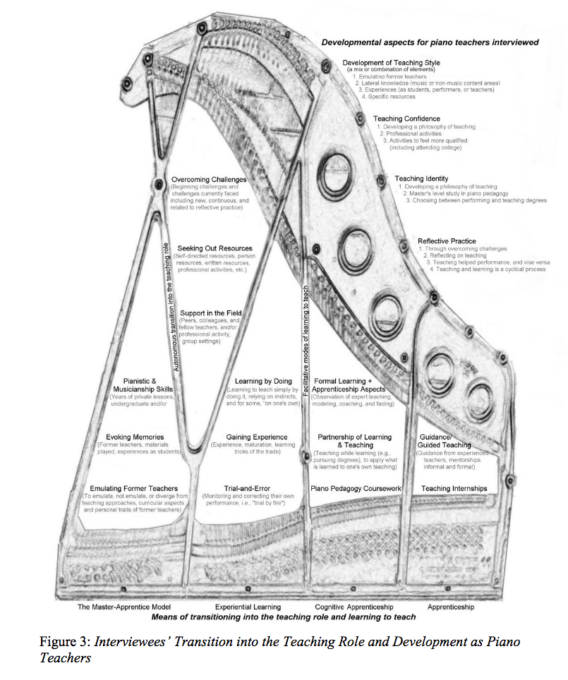

# qualitative-dissertation-research
A qualitative research study examining experiential learning and professional development through the lens of practice-based education.

## Research Overview
This repository showcases an in-depth qualitative research study examining the intersection of experiential learning, professional development, and identity formation in practice-based professional learning. Through systematic analysis of 40 hours of interview data, this study reveals key insights into how professionals develop expertise through various learning modalities including apprenticeship, cognitive apprenticeship, and autonomous learning.

## Published Research
📚 **Full Dissertation**: [Learning to Teach: Examining the Knowledge and Preparation of Successful Piano Teachers](https://digitalcommons.usf.edu/etd/3352/)  
*University of South Florida, USF Scholar Commons*

Direct Link: [https://digitalcommons.usf.edu/etd/3352/](https://digitalcommons.usf.edu/etd/3352/)

### Quick Access Documents
- [Research Abstract](https://github.com/mslawsky/qualitative-dissertation-research/blob/main/dissertation-abstract.pdf)
- [Qualitative Findings](https://github.com/mslawsky/qualitative-dissertation-research/blob/main/qualitative-findings.pdf)

## Thematic Analysis Framework

### Evolution of Analysis
The thematic framework evolved through careful analysis of interview data, as visualized in these key artifacts:

1. **Original Inspiration**  

*Initial conceptual framework inspiration*

2. **Thematic Analysis Framework**  

*Final thematic framework showing the integration of identified themes and relationships*

## Qualitative Data Analysis Process

### Raw Data Analysis
The complete coding structure is available in two detailed grid views:
- [Major Themes Grid](major-themes-grid.csv) - Primary thematic categories and their relationships
- [Sub-Themes Grid](sub-themes-grid.csv) - Detailed breakdown of subthemes and their connections

### Primary Themes

#### 1. Means of Transitioning
- Master-Apprentice Model
- Autonomous transition
- Experiential Learning
- Cognitive Apprenticeship
- Traditional Apprenticeship

#### 2. Development Aspects
- Teaching Style Development
- Professional Confidence
- Identity Formation
- Reflective Practice

#### 3. Professional Growth
- Formal Learning Integration
- Challenge Navigation
- Resource Utilization
- Community Support

## Research Methodology

### Data Collection & Analysis Tools
- NVivo Qualitative Data Analysis Software
- Systematic coding framework development
- Iterative theme refinement process

### Analysis Workflow
1. **Initial Coding**
   - Raw interview transcription
   - Open coding in NVivo
   - Initial theme identification

2. **Theme Development**
   - Pattern identification
   - Category refinement
   - Framework development

3. **Final Analysis**
   - Theme consolidation
   - Relationship mapping
   - Visual framework creation

## Repository Structure
.
├── thematic-analysis.png      # Final thematic framework visualization
├── piano-frame.jpg           # Initial conceptual framework
├── major-themes-grid.csv     # Primary themes analysis grid
├── sub-themes-grid.csv       # Detailed subthemes analysis
├── dissertation-abstract.pdf  # Research overview
└── qualitative-findings.pdf  # Detailed findings

## Keywords
`induction` `apprenticeship` `experiential learning` `cognitive apprenticeship` `practice-based professional learning` `tacit knowledge` `professional development` `teacher training` `professional education` `identity` `reflective practice` `qualitative research` `thematic analysis`

## Research Impact
This research contributes to understanding how professionals develop expertise through various learning modalities. Key implications include:

- Understanding the role of experiential learning in professional development
- Identifying effective support mechanisms for early-career professionals
- Mapping the development of professional identity
- Documenting the impact of reflective practice

## Future Applications
The methodological approach and findings can be applied to:
- Professional development program design
- Mentorship program structuring
- Educational curriculum development
- Professional identity research

## Data Usage and Analysis
The CSV files included in this repository demonstrate:
- Systematic approach to qualitative coding
- Theme development progression
- Relationship identification between concepts
- Data condensation methodology

## Contact
For research inquiries or collaboration opportunities, please reach out through:
- [LinkedIn Profile](https://www.linkedin.com/in/melissaslawsky/)
- [Professional Website](https://melissaslawsky.com/client-results/)
- [Email](mailto:melissa@melissaslawsky.com)

---
© Melissa Slawsky 2024. All Rights Reserved.
This repository contains proprietary research and analysis. All rights are reserved by the author. No part of this repository may be reproduced, distributed, or transmitted in any form or by any means without the prior written permission of the author.

Published Dissertation URL: [https://digitalcommons.usf.edu/etd/3352/](https://digitalcommons.usf.edu/etd/3352/)
